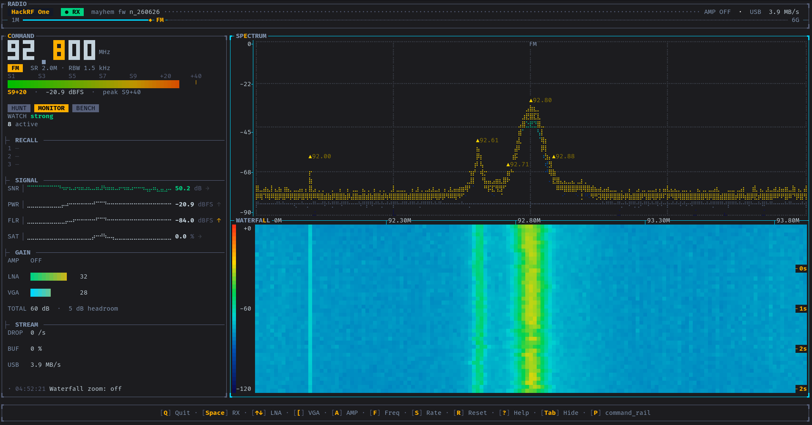
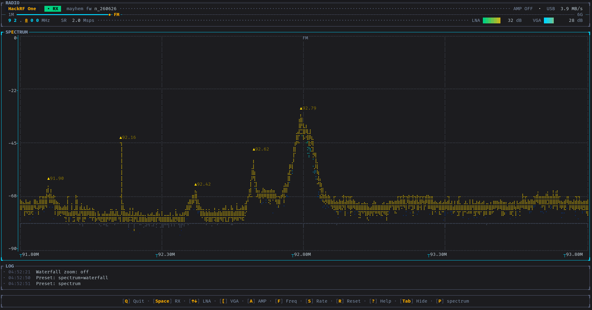
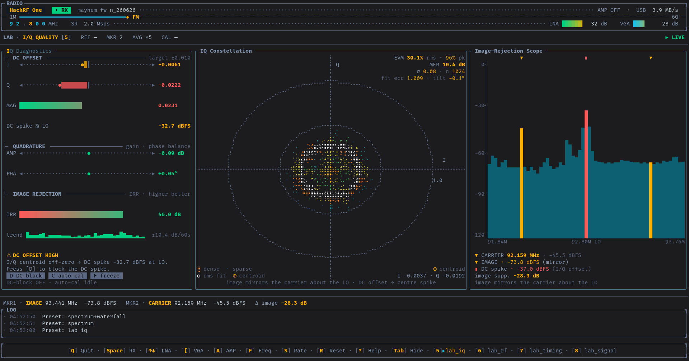
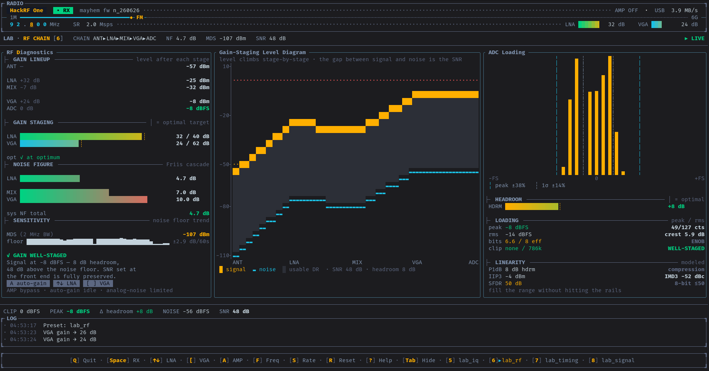
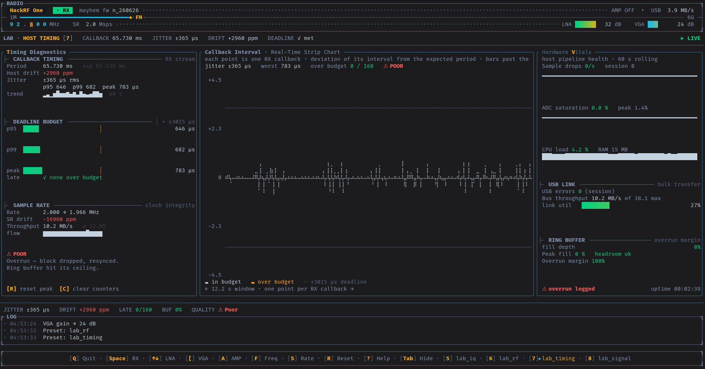
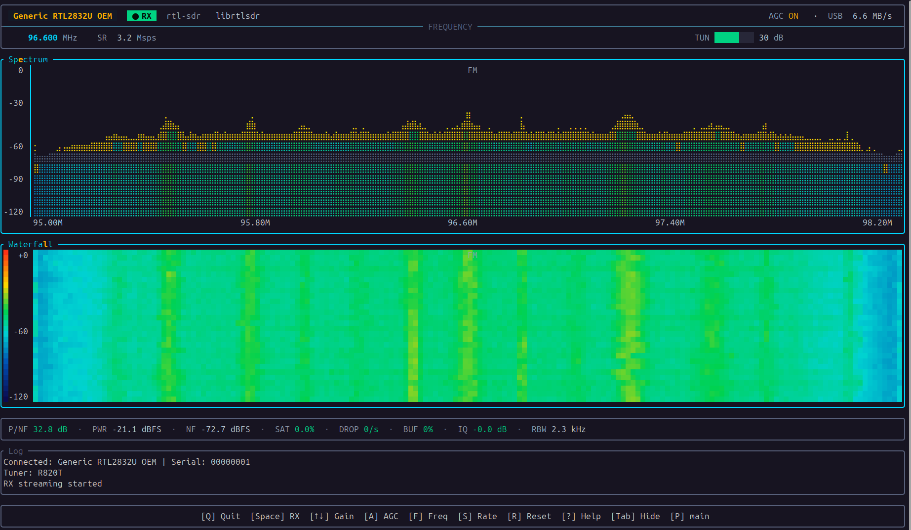
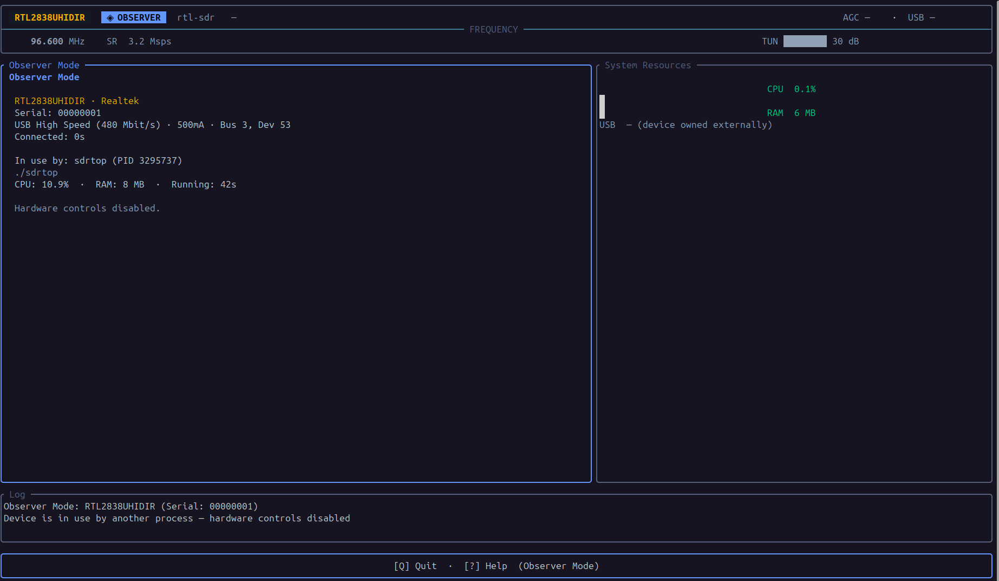

# sdrtop

[](https://www.rust-lang.org)
[](LICENSE)
[]()
[]()

[](https://greatscottgadgets.com/hackrf/one/)
[](https://www.rtl-sdr.com/)
[](https://github.com/portapack-mayhem/mayhem-firmware)

<p align="center">
  <a href="#quick-start">Quick start</a> ·
  <a href="#keys">Keys</a> ·
  <a href="#config">Config</a> ·
  <a href="#supported-hardware">Hardware</a>
</p>

**Hey there! This is my take on a terminal monitor for SDR hardware.** I wanted something that could hunt down every bit of diagnostic data from your radio and stream it straight to your terminal.

I didn't want to cut corners, so this definitely isn't just a lazy hardware info tool clone. It delivers raw, real-time metrics (spectrum, waterfall, ADC health, gain chain) right inside the terminal. It's lightweight, distraction-free, and fits perfectly into a tmux pane, an SSH session, or the custom screen of your cyberdeck.

It's a one-person project built in my spare time, and honestly, I made it for *you* ❤️. Use it however you like, beat on it, and don't be shy: open issues, dig through the code, and if you've got a good idea, send it my way as a pull request or just a message. This is an open table, not my private garage.

> [!IMPORTANT]
> **Project status: early development.**
>
> * **Hardware:** the **HackRF One** is fully supported, and **RTL-SDR support has landed and works** 🎉 (R820T / R828D / E4000). It's community-contributed and confirmed on real hardware, both normal RX and observer mode. Huge thanks to [@gorkemgun](https://github.com/gorkemgun) for implementing the backend! 🙌 RTL clones vary, though, and I can't test them all, so please try it on yours and [open an issue](../../issues) if anything's off.
> * **Software:** the **interactive TUI is feature-complete** (spectrum, waterfall, the IQ / RF / timing / signal / sweep lab presets, and the micro field views). The focus now is **polishing the UI, sharpening the radio math, and fixing bugs**, not piling on features.
> * **Known issues:** plenty 😄 If something looks broken, it's either a bug or an undocumented feature. Flip a coin, then open an issue.

### 📖 Documentation

**[→ Full user guide](user_docs/README.md)** - everything below, in depth. Or jump straight to:

| | | |
|---|---|---|
| [Getting started](user_docs/getting-started.md) - install & run | [Keyboard shortcuts](user_docs/keys.md) - every key | [What's on screen](user_docs/screens.md) - panels explained |
| [The Lab presets](user_docs/lab.md) - the bench-engineer views | [Configuration](user_docs/config.md) - config.toml & custom layouts | [Themes](user_docs/themes.md) - the six palettes |
| [Tips & tricks](user_docs/tips-and-tricks.md) - gain, markers, workflows | [Troubleshooting](user_docs/troubleshooting.md) - when things go sideways | [What's new](user_docs/whats-new.md) - the checkpoint log |

---

## Gallery

<p align="center">
  <video src="user_docs/pics/hackrf/video.mp4" width="100%" controls muted loop playsinline poster="user_docs/pics/hackrf/command_rail.png">
    <a href="user_docs/pics/hackrf/video.mp4">sdrtop in motion</a>
  </video>
</p>

*It's a terminal app, so brace yourself for the visual spectacle of monospace text in color. The only special effects are honest dBFS numbers.*

Screenshots, split by device. More to come. Got a clean capture on your hardware? Drop it in [`user_docs/pics/`](user_docs/pics/) and send a PR (RTL-SDR shots from different tuners especially welcome).

<details open>
  <summary><b>📻 HackRF One</b> - spectrum, waterfall &amp; lab presets</summary>
  <br>
  <table>
    <tr>
      <td width="50%"></td>
      <td width="50%"></td>
    </tr>
    <tr>
      <td width="50%"></td>
      <td width="50%"></td>
    </tr>
    <tr>
      <td width="50%"></td>
      <td width="50%"></td>
    </tr>
  </table>
</details>

<details>
  <summary><b>📡 RTL-SDR</b> - spectrum, waterfall &amp; observer mode</summary>
  <br>
  <table>
    <tr>
      <td width="50%"></td>
      <td width="50%"></td>
    </tr>
  </table>
</details>

---

## What it shows

Everything your radio knows about itself, in real time, without leaving the terminal.

### The Command Rail: the default cockpit (`1`)
The view sdrtop opens on. A slim header plus a left **instrument rail** that packs what a poweruser reads at a glance: a big segmented **frequency hero**, an analog **S-meter**, the **HUNT · MONITOR · BENCH** mode tabs whose lead card follows what you're doing, **recall slots** with live activity pips, and a SIGNAL zone where SNR · PWR · NF · SAT each ride their own little braille oscilloscope trace beside the value. Gain and stream health round it out, and the bonded spectrum + waterfall fill the rest. Press `c` to drive it, `←/→` to tune. All dials, no autopilot. It's a radio, not a self-driving car.

<details>
  <summary><b>🛰️ Command Rail</b> - the BENCH &amp; HUNT mode cards</summary>
  <br>
  <table>
    <tr>
      <td width="50%"></td>
      <td width="50%"></td>
    </tr>
  </table>
</details>

<p align="center"><sub>· · ·</sub></p>

### Live spectrum & waterfall
- **Spectrum analyzer** - FFT with EMA smoothing, peak hold, noise floor tracking, dBFS axis, zoom, band-plan overlay, and persistent frequency markers
- **Waterfall** - scrolling spectrogram in truecolor / 256-color / 16-color, with adjustable color scale, history scroll-back, and frame averaging for longer time windows
- **Focus modes** - press the highlighted letter in a panel's title to take it over: `e` spectrum, `l` waterfall, plus cursor read-outs, holds, and markers without ever touching the mouse

<p align="center"><sub>· · ·</sub></p>

### Bench-engineer measurements (the Lab presets)
- **RF chain** - tuned frequency with wavelength (λ, λ/4 for cutting antennas), a visual gain chain, estimated **noise figure** (Friis), **minimum detectable signal** (MDS) in dBm, an ADC-utilisation gauge, and a gain advisor that tells you when you're starving or clipping the front end
- **IQ diagnostics** - DC offset, amplitude/phase imbalance and **image rejection ratio** (IRR), drawn as analog **null-meters** (centre is ideal, the needle shows the deviation). Paired with a **persistence constellation**: a phosphor-style I/Q cloud coloured by density, with a fitted imbalance ellipse whose stretch reads amplitude imbalance and whose tilt reads phase imbalance
- **IQ histogram** - ADC amplitude distribution with a Low/Mid/Clip breakdown and **PAPR** (crest factor) that fingerprints the signal type at a glance
- **Timing** - USB transfer cadence, throughput, and jitter with a quality verdict and session peak tracking
- **Hardware vitals** - drops, ADC saturation, sdrtop's own CPU/RAM, USB errors, configured-vs-measured sample rate, and buffer fill, every one with a trend sparkline

<p align="center"><sub>· · ·</sub></p>

### Scanning & field views
- **Frequency sweep** - scan a band wider than one window can show; sdrtop retunes across it, stitches the result into a single curve with band-plan labels, and lets you press `Enter` on a peak to tune straight to it
- **Micro field views** - the deliberately tiny mode (`0`). The idea: sdrtop shouldn't need a full terminal to be useful. When it's squeezed into a slim tmux split, an SSH session on a phone, or the postage-stamp screen of a cyberdeck, the full panels stop being readable, so the micro views strip each concern down to a single glance (signal · gain · health · sweep) and let you cycle between them. One number that matters, big enough to read across the room. *(Heads up: the looks are still cooking, the idea's solid, the pixels are a work in progress.)*
- **Signal strip** - one live bar with the essentials: P/NF · channel power · noise floor · ADC saturation · drops · buffer fill · IQ imbalance · RBW
- **Observer mode** - if another app already holds the radio, sdrtop shows device identity, the owning process, and USB stats instead of falling over, then reclaims the device when it's free

<p align="center"><sub>· · ·</sub></p>

### Make it yours
- **Six themes** - `sdr` · `nord` · `dracula` · `gruvbox` · `catppuccin` · `solarized`
- **Layout presets** - general + specialised lab layouts; switch on the fly with the number keys, cycle with `p`, or define your own in the config

> Every lab panel marks itself **[STALE]** the moment RX stops, so a frozen number is never mistaken for a live one. Because the only thing worse than no data is confidently wrong data.

---

## Quick start

**Requirements:** Linux · HackRF One *or* RTL-SDR · `libhackrf` + `librtlsdr` + `pkg-config` · Rust stable

### Arch

```sh
# Arch
sudo pacman -S hackrf rtl-sdr pkgconf rust
```
### Debian / Ubuntu

```sh
sudo apt install libhackrf-dev librtlsdr-dev pkg-config
```

You also need Rust installed. If you don't have it yet:

```sh
curl --proto '=https' --tlsv1.2 -sSf https://sh.rustup.rs | sh
```

### Then build:

```sh
cargo build --release
./target/release/sdrtop
```

Press `Space` to start receiving. Press `?` for the key reference. Press `q` to quit and save.

---

## Keys

| Key        | Action                         |
| ---------- | ------------------------------ |
| `Space`    | Start / stop RX                |
| `↑` / `↓` | LNA gain ±8 dB                 |
| `[` / `]`  | VGA gain ±2 dB                 |
| `a`        | Toggle RF amplifier            |
| `f`        | Enter frequency (MHz)          |
| `s`        | Enter sample rate (2-20 MHz)   |
| `r`        | Reset all settings to defaults |
| `w`        | Pause / resume waterfall       |
| `h`        | Hold / unhold spectrum frame   |
| `e`        | Focus spectrum panel           |
| `l`        | Focus waterfall panel          |
| `i` / `v` / `t` / `g` | Focus lab panel: IQ / hardware vitals / timing / sweep |
| `1`-`4`    | Switch built-in layout preset  |
| `5` / `6` / `7` / `8` / `9` | Lab presets: IQ / RF / timing / signal / sweep |
| `0`        | Micro field-mode view (compact; cycles signal → gain → health → sweep) |
| `p`        | Cycle presets                  |
| `Tab`      | Toggle footer bar              |
| `?`        | Help overlay                   |
| `q`        | Quit and save config           |

> **On an RTL-SDR** the gain keys adapt to the hardware: `↑`/`↓` step the tuner's single discrete gain table and `a` toggles tuner **AGC** (there's no separate VGA stage, so `[`/`]` sit out). The UI relabels itself accordingly, no muscle memory to relearn. With more than one radio plugged in, a picker appears at launch; pin one with `--device hackrf|rtlsdr`.

---

## Config

Everything is saved automatically to `~/.config/sdrtop/config.toml` when you quit, and hand-editing is safe: a missing or broken file just falls back to defaults. Go ahead, mangle it; the parser has seen worse.

```toml
[radio]
frequency_hz = 92800000      # tuned center frequency
sample_rate  = 2000000.0     # HackRF 2-20 MHz · RTL-SDR 0.9-3.2 MHz
lna_gain     = 24            # HackRF LNA / RTL-SDR tuner gain
vga_gain     = 30            # HackRF only (ignored on RTL-SDR)
amp_enabled  = false        # HackRF RF amp / RTL-SDR tuner AGC

[display]
active_preset      = "spectrum_waterfall"
waterfall_max_rows = 64

# Spectrum markers persist here, one block each
[[display.spectrum_markers]]
freq_hz = 92800000
label   = "FM Radio"

[sweep]
start_hz = 400000000         # frequency scanner: band start
stop_hz  = 500000000         # band end
dwell_ms = 200               # measure time per step (50-2000)

[theme]
base = "nord"
# optional per-field overrides:
# border_accent = "#88c0d0"
# value_hi      = "#ebcb8b"
```

**Themes:** `sdr` (default) · `nord` · `dracula` · `gruvbox` · `catppuccin` · `solarized`. See [Themes](user_docs/themes.md).

**Custom layouts:** define your own `[presets.*]` blocks and they merge with the built-ins, surviving every save. Full reference in [Configuration](user_docs/config.md#custom-layout-presets).

---

## Supported hardware

| Device                                 | Status            | Notes                                     |
| -------------------------------------- | ----------------- | ----------------------------------------- |
| HackRF One                             | ✅ Full support    | All diagnostics, gain stages, ADC metrics |
| RTL-SDR (R820T, E4000, R828D)          | ✅ Working *(new)* | Community-contributed, confirmed on hardware - **test on your clone & report** |
| PortaPack H4M (Mayhem)                 | 🔧 In development | Telemetry panel via CDC/ACM serial        |
| Airspy Mini / Airspy HF+               | 🔲 Planned        | Needs hardware                            |
| HackRF Pro                             | 🔲 Planned        | Needs hardware                            |
| LimeSDR / bladeRF / SDRplay / PlutoSDR | 🔲 Planned        | Needs hardware                            |

> Hardware support is added only after physical testing on real devices. No guessing from datasheets. (Translation: the list moves at exactly the speed of my hobby budget.)

---

## Roadmap

### Right now: polish over features
The feature set is in. So the whole focus has shifted to **making what's already here genuinely good**:

- [ ] **UI polish** - layout, spacing, color, readability, and the small edge cases that make a TUI feel hand-built instead of merely functional
- [ ] **Micro view redesign** - the field views (`0`) do their job, but the layout deserves a rethink: bigger, calmer, easier to read at a glance on a tiny screen
- [ ] **Sharper radio math** - auditing and refining the derived measurements (NF, MDS, IRR, PAPR, sample-rate accuracy, timing) so the numbers are not just present but *trustworthy*
- [ ] **Bug fixes** - hunting down the rough edges before piling on anything new

No shiny new features until this list feels done. Quality arc, not a feature sprint. ✨

### Just landed 🎉
- [x] **RTL-SDR support** - R820T / R828D / E4000, the most common dongle on Earth, behind a clean device-abstraction layer ✅ *in and working.* Community-contributed and confirmed on real hardware (RX + observer mode). The RTL clone zoo is vast and I can't test it all, so it still wants **testing across the variety, reports welcome and genuinely useful**.

### Hardware pipeline
- [ ] Airspy Mini / Airspy HF+ Discovery
- [ ] HackRF Pro
- [ ] LimeSDR / bladeRF / SDRplay / PlutoSDR via SoapySDR

### Later (once polish + RTL-SDR are home)
- [x] Frequency scanner mode - the `lab_sweep` / `micro_sweep` scanner ✅ *done*
- [ ] Signal recording to file
- [ ] In-app config editing (no hand-editing TOML)

---

## Supporting the project

`sdrtop` is built to support every SDR device out there, but that requires actually owning them. Development here runs on a HackRF One and a PortaPack H4M. The **RTL-SDR backend is now in and working** (community-contributed, confirmed on real hardware), the most common SDR hardware in the world, and the most impactful single addition this project could make. I just don't have a dongle here yet, so it's still on the buy list, and testing across the clone zoo is community-powered for now.

The more expensive hardware (Airspy, LimeSDR, SDRplay) I'm saving toward, but that takes longer. If you use `sdrtop` and want to see support for your device sooner, contributions go directly toward hardware purchases. Every device that arrives gets a proper backend: tested on real hardware, documented, shipped.

| Device               | Why it matters                                                    | Price |
| -------------------- | ----------------------------------------------------------------- | ----- |
| RTL-SDR Blog V4      | Most common SDR dongle - immediate impact on user base            | ~€25  |
| Airspy Mini          | Clean 24-1700 MHz, popular with hams and scanner hobbyists        | ~€80  |
| Airspy HF+ Discovery | Best budget HF receiver, dedicated listener community             | ~€150 |
| LimeSDR Mini 2.0     | Full-duplex, wide range - opens up SoapySDR for dozens of devices | ~€160 |

No pressure, but if this scratches an itch for you, this is where it goes.

[](https://ko-fi.com/mustang6139)

---

<details>
<summary>📡 <i>(pst… you scrolled this far, might as well)</i></summary>

<br>

```
                .
               /=\
          (    |#|    )
         ((    |#|    ))
        (((    |#|    )))
         ((    |#|    ))
          (    |#|    )
               |#|
              /|#|\
             / |#| \
            /  |#|  \
           /___|#|___\
          /    |#|    \
         '''''''''''''''
```

Yep, it's a radio tower. I'm a simple man, I see free time, I make ASCII art.

**73 de sdrtop**: ham-speak for "catch you later." 📻

</details>

---

**[Credits](CREDITS.md)**
